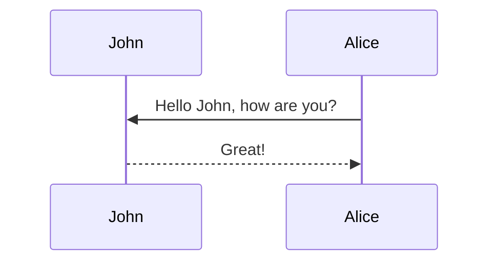

## Introduction

Design patterns are standard solutions to common software design problems. They are not finished designs that can be directly transformed into code but are templates that guide implementation. In Python, many of these patterns can be expressed cleanly and concisely due to the language's dynamic features and simplicity.

This article provides an overview of commonly used design patterns in Python, with practical examples and guidance on when to apply each.

### 1. Creational Patterns
| Pattern  | Description  |
|---|---|
| Singleton  |   |
| Factory Method  |   |
| Builder  |   |
| Builder Factory  |   |
| Abstract Factory  |   |


This theme supports generating various diagrams from a text description using [mermaid](https://mermaid-js.github.io/mermaid/){:target="\_blank"}. Previously, this was done using the [jekyll-diagrams](https://github.com/zhustec/jekyll-diagrams){:target="\_blank"} plugin. For more information on this matter, see the [related issue](https://github.com/alshedivat/al-folio/issues/1609#issuecomment-1656995674). To disable the zooming feature, set `mermaid.zoomable` to `false` in this post frontmatter.

## Mermaid

The diagram below was generated by the following code:

````markdown

````


